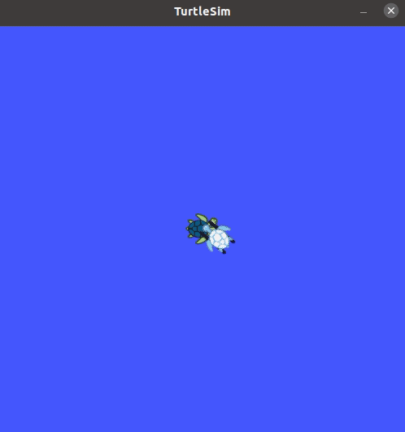

# README

## 1. Objective

1. comprehend the concept of ROS **Node, Topic, Message**
2. see how tf works
3. learn how to use them in code by a simple `turtlesim` example

## 2. Task 

1. leader turtle is controlled by keyboard inputs and the other turtle is programmed to follow it.
2. complete `turtle_chase.py` by group.

## 3. utils

### 3.1 How to compile your workspace

```bash
# init own workspace as manual-Appendix A.4
$ cd catkin_(yourID)
$ catkin_make
```

### 3.2 How to source your workspace (before open a new terminal )

```bash
$ cd catkin_(yourID)
$ source devel/setup.bash
```

### 3.3 How to make your script executable

```bash
$ cd catkin_(yourID)/src/lab2pkg_turtle/scripts 
$ chmod +x turtle_chase.py
$ chmod +x turtle_spawn.py
$ chmod +x turtle_tf2_broadcaster.py
```

### 3.4 How to run your code

```bash
# run demo
$ roslaunch lab2pkg_turtle turtle_tf2_demo.launch
# run turtle_chase
$ roslaunch lab2pkg_turtle turtle_chase.launch
```

## example


