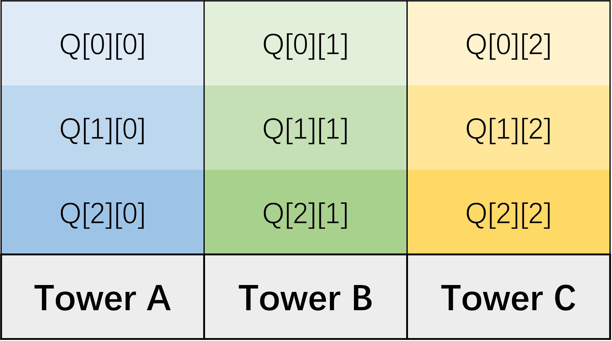

# README

## 1. Task

To solve The Hanoi problem by ROS programming.

### what is different 

1. work for **any** starting and ending location
2. **Strict** alignment
3. **Bonus** for taking gripper feedback into consideration

### what to do 

1. complete basic **subscriber** to subscribe io state and **publisher** to publisher to set io.

2. complete corresponding **callback** function.

3. **record** all block position (in the form of joint angles) by **FreeMove** UR3 to desired target and store them into Q array, the recommend Q array structure:

    

4. complete manipulation code.

## 2. Code

- `lab3_exec.py`: main code to execute task
- `lab3_ur3e.py`: define ur3e's publisher and subscriber
- `lab3_header.py`: some headers and store the **message types** that will be used in this lab.

## 3. utils

### 3.1 Step to test your code with robot

```bash
$ roslaunch ur_robot_driver ur3e_bringup.launch robot_ip:=192.168.1.120
# (new terminal)
$ rosrun ur3e_driver_ece470 ur3e_driver_ece470
# (new terminal)
$ rosrun lab3pkg_hanoi lab3_exec.py
# DO NOT FORGET to press `start` button in Teach Pendant
```

### 3.2 How to connect your robot

```bash
$ roslaunch ur_robot_driver ur3e_bringup.launch robot_ip:=192.168.1.120

# create a program with External Control program in Teach Pendant and start program after launching the driver.
# when you see following responses in the terminal, that means Robot is ready!
$ [INFO] [1571124040.693851608]: Robot requested program
$ [INFO] [1571124040.693924407]: Sent program to robot
$ [INFO] [1571124040.772090597]: Robot ready to receive control commands.
```

### 3.3 How to compile your workspace

```bash
$ cd catkin_(yourID)
$ catkin_make
```

### 3.4 How to source your workspace (after open a new terminal )

```bash
$ cd catkin_(yourID)
$ source devel/setup.bash
```

### 3.5 How to make your script executable

```bash
$ cd catkin_(yourID)/src/lab3pkg_hanoi/scripts 
$ chmod +x lab3_exec.py
```
