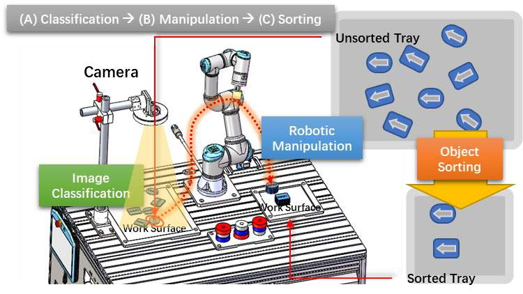
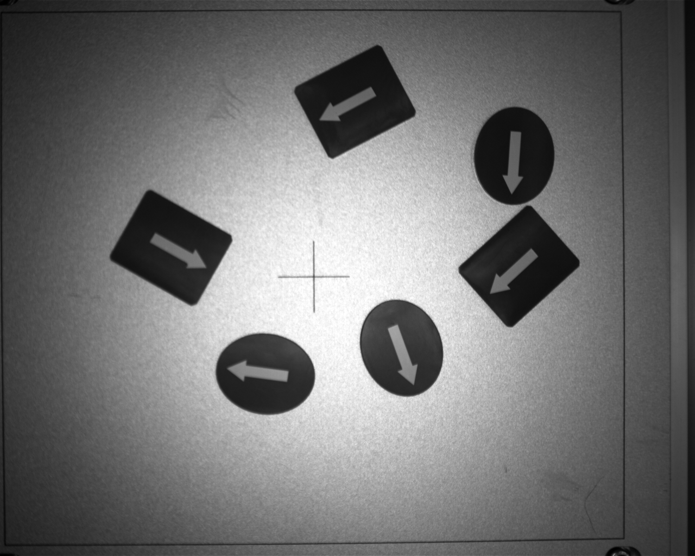
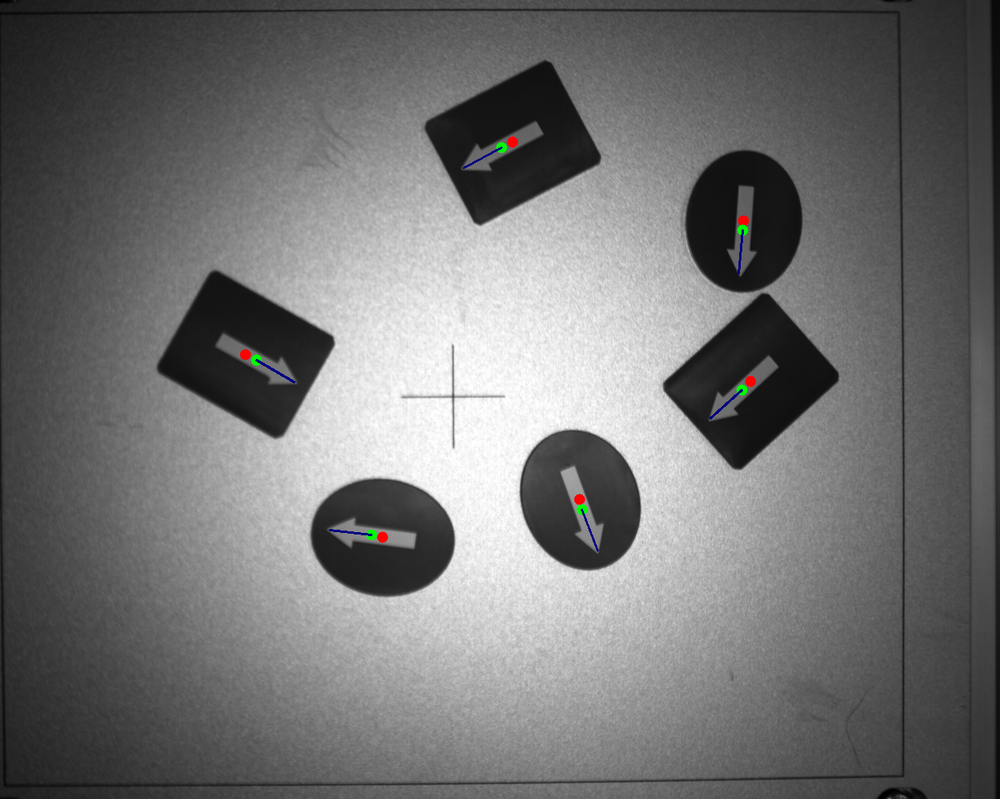

# README

## 1. Task



Our **main task** in the following two labs is to pick and place all the blocks on the left to the desired destination on the right. Camera is used to detect blocks. With **image processing** methods, robot is able to know the **position**, **shape** and **orientation** of the blocks. Since block's position is based on image coordinate, what else we should do is to **transform it into robot coordinate**.

- **Place Requirements:**
  1. Two stacked piles with **same shape, orientation**.
  2. At least 6 **different randomly** placed blocks.

> [!IMPORTANT]
>
> **2024 Spring**
>
> Since we use a new type of camera (Realsense), do image processing with **newer version of snapshots.**
>
> **2023 Spring**
>
> ~~Due to lab schedule, this part of work needs to be completed **before Lab 7 by yourself**. we will **not** arrange extra lab session for **Lab 6**. Feel free to ask your TAs for help if you have any questions about this lab.~~

### What to do

Example images are in `lab6pkg_improc/img`. Here shows one example snapshot from the camera.



Image Processing should be done to identify the **shape** (rectangle and ellipse), **position** or **centroid** (used for grasping) and **orientation** (used for placing). Here shows an example result.




## 2. Code

- `lab6_img.py`: image processing code including *template matching*, *image filtering*, *edge detection*, *contour detection*

  ```bash
  python lab6_img.py
  ```

- `realsense_camera.py`: script for capturing a snapshot of camera’s view.

  ```bash
  python realsense_camera.py
  ```

### code explanation

refer to the code comments and find the reference results in `img/result`

