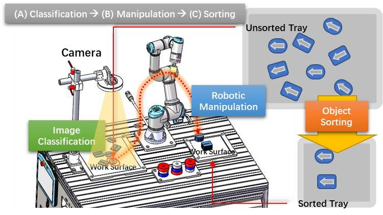

# README

## 1. Task



Our **main task** in the following two labs is to pick and place all the blocks on the left to the desired destination on the right. Camera is used to detect blocks. With **image processing** methods, robot is able to know the **position**, **shape** and **orientation** of the blocks. Since block's position is based on image coordinate, what else we should do is to **transform it into robot coordinate**.

- **Place Requirements:**
  1. Two stacked piles with **same shape, orientation**.
  2. At least 6 **different randomly** placed blocks.

### 1.1 what to do:

1. **Camera Calibration:** transform block's image coordinate into robot's coordinate
   - take two snapshots using `realsense_camera.py` api and record corresponding robot's coordinate. Tip: (move robot to approach the block and obtain the approximate value in Teach Pedant )
   - do the above image classification to identify image coordinate.
   - complete `coordinate_transform` function in `lab7_img.py` 
   - now you can obtain robot's coordinate Given a new set of blocks.
2. **Pick and Place**: program UR3e to complete the whole pick and place task use `move_arm` and `gripper` in lab3.

## 2. Code

- `lab7_exec.py`: main code to execute pick and place task.
- `lab7_func.py`: Forward Kinematics solver and Inverse Kinematics solver function. Pasted from previous lab4 and lab5.
- `lab7_ur3e.py`: UR3e class including `move_arm` and `gripper` 
- `lab7_img.py`: image processing function to identify the **shape**, **centroid** and **orientation**. **Coordinate Transformation** need to be done here. 
- `realsense_camera.py`: camera class to take snapshot and display image.

## 3. utils

> [!IMPORTANT]
>
> Snapshot by `python realsense_camera.py` now !

### 3.1 How to snapshot using ckcamera

> [!WARNING]
>
> `ckcamera` is **deprecated**, please use `realsense_camera.py` instead.

````python 
# define camera object
camera = CKCamera()
# init camera
camera.init()
# display image
camera.display()
```
1. Press 'Esc' to quit window
2. Press 's' to save image, default path: '../img/img_name.bmp'
Make sure to Focus on the image window, then 'Esc' or 's' will work.
After press 's' in image window, then input 'img_name' in the terminal, the snapshot will be store in 'img' folder.
```
# Another option to store image without display
camera.save_image(img_name) # default path:'../img/img_name.bmp'
# Uninit camera when finished snapshot
camera.uninit
````

### 3.2 Step to test your code with robot

```bash
$ roslaunch ur_robot_driver ur3e_bringup.launch robot_ip:=192.168.1.120
# (new terminal)
$ rosrun ur3e_driver_ece470 ur3e_driver_ece470
# (new terminal)
$ rosrun lab7pkg_pick_place lab7_exec.py
# Press `start` button in Teach Pendant after hints
```

### 3.3 How to connect your robot

```bash
$ roslaunch ur_robot_driver ur3e_bringup.launch robot_ip:=192.168.1.120

# create a program with External Control program in Teach Pendant and start program after launching the driver.
# when you see following responses in the terminal, that means Robot is ready!
$ [INFO] [1571124040.693851608]: Robot requested program
$ [INFO] [1571124040.693924407]: Sent program to robot
$ [INFO] [1571124040.772090597]: Robot ready to receive control commands.
```

### 3.4 How to compile your workspace

```bash
$ cd catkin_(yourID)
$ catkin_make
```

### 3.5 How to source your workspace (before open a new terminal )

```bash
$ cd catkin_(yourID)
$ source devel/setup.bash
```

### 3.6 How to make your script executable

```bash
$ cd catkin_(yourID)/src/lab7pkg_pick_place/scripts 
$ chmod +x lab7_exec.py
```
