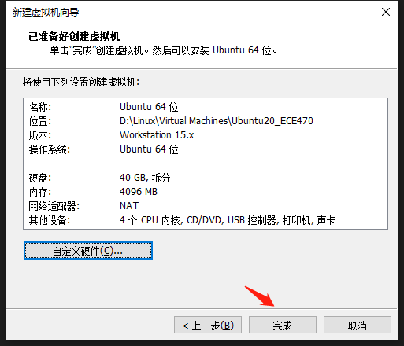

# Ubuntu_Install

## 1. Install system

1. create a new virtual machine and choose customized.

2. choose the version depend on your own choice.

3. choose your path of image and install system later.

4. choose Linux and Ubuntu 64.

5. name your machine and place it as you want.

6. assign processor for your virtual machine.

7. assign memory for your virtual machine.

8. add NAT for your network.

9. choose LSI Logic 

10. default value is fine.

11. default value is fine.

12. assign 30-40 GB for your virtual machine.

13. default value is fine.

14. see your configuration and complete it.

15. start your machine we configured and wait for a while. Then we will see this interface and choose install ubuntu.

16. choose language (English is preferred.)

17. the author prefers to Minimal installation. 

18. Install now!

19. shanghai!

20. set your user name and password and wait for a while. 

